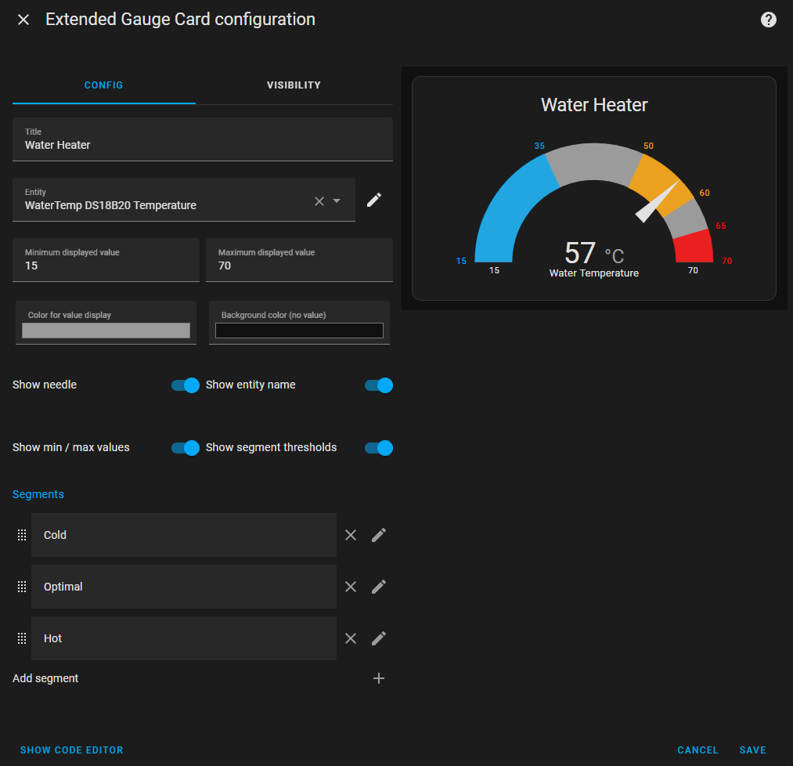

# Extended Gauge Card for Home Assistant
**Gauge Card with extended options.**

The Extended Gauge Card is inspired by the Home Assistant Gauge Card but offers additional options, such as displaying minimum and maximum values, an unlimited number of segments with lower and upper bounds, display of threshold values, and more.
 
 

  
 
 

## Features
- UI-based configuration for easy setup.
- Backward compatibility with YAML configuration.
- Shows minimum and maximum value.
- Individually configurable segments, each with a lower and upper bound, a color, and a replacement value.
- Unlimited number of segments.
- Shows values of segment bounds.
- Shows with or without a needle.
 
 

## Installation

### HACS (recommended)
Not available on HACS, yet.

This is the recommended installation method.

- Search for and install the Extended Gauge Card from HACS.
- Hard restart the browser by pressing ctrl-F5.

### Manual
Not available, yet.

- Download the .js file from the latest release.
- Copy the file into the /config/www folder of your Home Assistant installation. If the www folder does not exist, create it.
- In Home assistant got to *Settings* / *Dashboards*, press the three dots at the top right of the window and select *resources*.
- Click on *Add resource* and enter /local/extended-gauge.js, then click on *Create*.
- Hard restart the browser by pressing ctrl-F5.
 
 

## License

The Extended Gauge Card is published under the GNU General Public License v3.0.
 
 
 

## Attribution

This card is inspired by the Home Assistant Gauge Card.
 
 
 
 
 
 

## About sponsorship

If this Home Assistant card is useful to you, please consider supporting this project. Sponsorship helps keep the project going, improve features, and fix any issues that arise. Your contribution goes a long way in making the project better for everyone.

