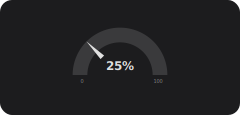
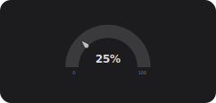
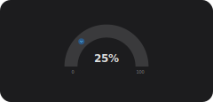
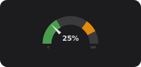
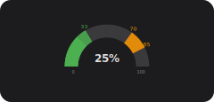
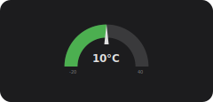
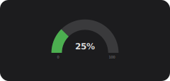
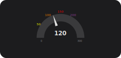

[](LICENSE)
[](https://github.com/custom-components/hacs)


[](https://github.com/microteq/extended-gauge/releases/latest)
[](https://community.home-assistant.io/t/extended-gauge-card/905595)


# Extended Gauge Card for Home Assistant
**A Home Assistant Gauge Card with extended functions and options.**

The Extended Gauge Card is inspired by the Home Assistant Gauge Card but offers additional options, such as displaying minimum and maximum values, an unlimited number of segments with lower and upper bounds, display of threshold values, and more.
<br />
<br />


<br />
<br />

## Features
- UI-based configuration for easy setup.
- Backward compatibility with YAML configuration.
- Shows minimum and maximum value.
- Individually configurable segments, each with a lower and upper bound, a color, and a replacement value.
- Unlimited number of segments.
- Shows values of segment bounds.
- Configurable display mode: full gauge with needle, dial only, or dial with needle shown simultaneously.
- Configurable needle styles: default, classic (original Home Assistant style), or icon-based needle.
<br />
<br />

## Visual examples

> To regenerate the preview images after making changes, run:
> ```bash
> node utils/scripts/generate-previews.js
> ```

For a full collection of ready-to-copy YAML configurations (CPU temperature, battery level, AQI, UV index, wind speed, CO₂, and more), see **[docs/examples.md](docs/examples.md)**.

### Default needle style



```yaml
type: custom:extended-gauge-card
main:
  display_mode: gauge_and_needle
```

---

### Classic Home Assistant needle style



```yaml
type: custom:extended-gauge-card
main:
  display_mode: gauge_and_needle
  needle:
    needle_style: classic
```

---

### Icon needle — rotating with gauge


```yaml
type: custom:extended-gauge-card
main:
  display_mode: gauge_and_needle
  needle:
    needle_style: icon
    needle_icon: mdi:chevron-down
    needle_icon_keep_vertical: false
    needle_icon_size: 2
    needle_icon_color: [91, 200, 255]
    needle_icon_background_color: [42, 92, 143]
```

---

### Icon needle — always vertical, moves along arc



```yaml
type: custom:extended-gauge-card
main:
  display_mode: gauge_and_needle
  needle:
    needle_style: icon
    needle_icon: mdi:chevron-down
    needle_icon_keep_vertical: true
    needle_icon_size: 2
    needle_icon_color: [91, 200, 255]
    needle_icon_background_color: [42, 92, 143]
```

---

### Segments with needle



```yaml
type: custom:extended-gauge-card
main:
  display_mode: gauge_and_needle
segment_list:
  - settings:
      segment_lower: 0
      segment_upper: 33
      segment_color: [76, 175, 80]
  - settings:
      segment_lower: 70
      segment_upper: 85
      segment_color: [255, 152, 0]
```

---

### Segment threshold labels



```yaml
type: custom:extended-gauge-card
main:
  show_segment_labels: true
segment_list:
  - settings:
      segment_lower: 0
      segment_upper: 33
      segment_color: [76, 175, 80]
  - settings:
      segment_lower: 70
      segment_upper: 85
      segment_color: [255, 152, 0]
```

---

### Custom value range



```yaml
type: custom:extended-gauge-card
main:
  min_value: -20
  max_value: 40
  display_mode: gauge_and_needle
entity:
  settings:
    unit_of_measurement: "°C"
```

---

### No needle — dial mode only



```yaml
type: custom:extended-gauge-card
main:
  display_mode: dial_only
```

---

<br />

## Installation

### HACS (recommended)
[](https://my.home-assistant.io/redirect/hacs_repository/?owner=microteq&repository=extended-gauge&category=plugin)

This is the recommended installation method.

- Search for and install the Extended Gauge Card from HACS.
- Hard restart the browser by pressing ctrl-F5.

### Manual

- Download the .js file from the latest release.
- Copy the file into the /config/www folder of your Home Assistant installation. If the www folder does not exist, create it.
- In Home assistant got to *Settings* / *Dashboards*, press the three dots at the top right of the window and select *resources*.
- Click on *Add resource* and enter /local/extended-gauge.js, then click on *Create*.
- Hard restart the browser by pressing ctrl-F5.
<br />
<br />

## Usage
After installing your Extended Gauge Card, edit your dashboard or create a new one. Add the Extended Gauge Card and configure it.

### Configuration

| Field name                                   | Description                                                                                                                                                                            |
|----------------------------------------------|----------------------------------------------------------------------------------------------------------------------------------------------------------------------------------------|
| *Entity*                                     | First, you need to select an entity that contains the numeric value you want to display. As long as no entity is selected, demo values will be shown and will update every 5 seconds.  |
| *Title*                                      | If you want the card to have a title, you can enter it in this field.                                                                                                                  |
| *Minimum&nbsp;displayed&nbsp;value*          | The value at which the gauge display begins.                                                                                                                                           |
| *Maximum&nbsp;displayed&nbsp;value*          | The value at which the gauge display ends.                                                                                                                                             |
| *Color&nbsp;for&nbsp;value&nbsp;display*     | The default background color when the needle is shown, or the color of the current value display if the needle is hidden.                                                              |
| *Background&nbsp;color&nbsp;(no&nbsp;value)* | The default background color when the needle is shown, or the color of the current value display if the needle is hidden.                                                              |
| *Display mode*                               | Selects how the gauge is rendered. Options: `gauge_and_needle` (full gauge with needle), `dial_only` (no needle), `dial_and_needle` (dial fill arc and needle shown at the same time). |
| *Use color gradient*                         | Toggle to smoothly transition between segment colors instead of using distinct solid color bands.                                                                                      |
| *Show entity name*                           | Toggle to show or hide the entity name below the value.                                                                                                                                |
| *Show min&nbsp;/&nbsp;max values*            | Toggle to show or hide the gauge’s minimum and maximum values.                                                                                                                         |
| *Show&nbsp;segment&nbsp;thresholds*          | Toggle to show or hide the segment threshold values.                                                                                                                                   |
<br />

> **Note:** Older configs created before `display_mode` was introduced may still use the `show_needle` YAML option. It is deprecated but continues to work as a fallback when `display_mode` is not set. We recommend migrating to `display_mode`.

### Editing the entity
To gain more control over how the entity value is displayed, click the edit button to the right of the selected entity ID.

| Field name                      | Description                                                                                                                                                                                    |
|---------------------------------|------------------------------------------------------------------------------------------------------------------------------------------------------------------------------------------------|
| *Name*                          | Give your entity a custom name. This name will be displayed below the value instead of the entity ID.                                                                                          |
| *Unit&nbsp;of&nbsp;measurement* | The unit that should be displayed next to the value.                                                                                                                                           |
| *Conversion factor*             | The value provided by the entity will be divided by this number. For example, if the entity provides power in watts, entering a conversion factor of 1000 will display the value in kilowatts. |
| *Number of decimals*            | The number of decimal places to be displayed.                                                                                                                                                  |
| *Thousands separator*           | The character to be used as the thousands separator.                                                                                                                                           |
| *Decimal separator*             | The character to be used as the decimal separator.                                                                                                                                             |
<br />

### Editing the needle settings
When *Display mode* is set to `gauge_and_needle` or `dial_and_needle`, click **Edit needle settings** to configure the needle appearance.

| Field name              | Description                                                                                                                                                                                                                        |
|-------------------------|------------------------------------------------------------------------------------------------------------------------------------------------------------------------------------------------------------------------------------|
| *Needle style*          | The visual style of the needle. Options: `default` (current arrow style), `classic` (original Home Assistant gauge needle), `icon` (a custom MDI icon).                                                                            |
| *Needle icon*           | Only used when *Needle style* is set to `icon`. Select any MDI icon to use as the needle indicator.                                                                                                                                |
| *Keep icon vertical*    | Only used when *Needle style* is set to `icon`. When enabled, the icon stays upright and does not rotate with the gauge direction; it only moves along the gauge arc. When disabled, the icon rotates to follow the gauge bearing. |
| *Icon size multiplier*  | Only used when *Needle style* is set to `icon`. Scales the icon. `1` is the default size; `2` doubles it, `0.5` halves it.                                                                                                         |
| *Icon color*            | Only used when *Needle style* is set to `icon`. Sets the fill color of the icon.                                                                                                                                                   |
| *Icon background color* | Only used when *Needle style* is set to `icon`. Draws a filled circle behind the icon to make it stand out against the gauge arc.                                                                                                  |
<br />

**YAML example — classic needle style:**
```yaml
type: custom:extended-gauge-card
main:
  display_mode: gauge_and_needle
  needle:
    needle_style: classic
```

**YAML example — icon needle with size, color and background:**
```yaml
type: custom:extended-gauge-card
main:
  display_mode: gauge_and_needle
  needle:
    needle_style: icon
    needle_icon: mdi:chevron-down
    needle_icon_keep_vertical: true
    needle_icon_size: 2
    needle_icon_color: [91, 200, 255]
    needle_icon_background_color: [42, 92, 143]
```

**YAML example — needle and dial shown simultaneously:**
```yaml
type: custom:extended-gauge-card
main:
  display_mode: dial_and_needle
```
<br />

### Adding segments
Add segments with threshold values to your gauge to highlight specific value ranges. Click “Add segment” or the plus icon to add a new segment. You can add as many segments as you like, but adding too many may reduce the gauge’s readability.

| Field name            | Description                                                                                                                                                                                                                                                   |
|-----------------------|---------------------------------------------------------------------------------------------------------------------------------------------------------------------------------------------------------------------------------------------------------------|
| *Title*               | The title or name of the segment. This is not displayed and is for your reference only. To avoid confusion about the purpose of each segment when multiple segments are used, you can only add a new segment after you have given a name to the previous one. |
| *Lower bound*         | The lower bound of the segment. If not specified, the gauge's minimum value will be used by default.                                                                                                                                                          |
| *Upper bound*         | The upper bound of the segment. If not specified, the gauge's maximum value will be used by default.                                                                                                                                                          |
| *Segment color*       | The color in which the segment should be displayed.                                                                                                                                                                                                           |
| *Override&nbsp;value* | A text that will be shown instead of the entity’s value when it falls within the segment bounds.                                                                                                                                                              |
<br />

**YAML example — smooth AQI/rainbow gradient:**
By enabling the *Use color gradient* option, the gauge will smoothly transition between segment colors instead of showing hard boundaries.



```yaml
type: custom:extended-gauge-card
entity: sensor.aqi
main:
  min_value: 0
  max_value: 300
  use_gradient: true
segment_list:
  - id: 1
    title: Good
    settings:
      segment_lower: 0
      segment_upper: 50
      segment_color:
        - 76
        - 175
        - 80
  - id: 2
    title: Moderate
    settings:
      segment_lower: 50
      segment_upper: 100
      segment_color:
        - 255
        - 235
        - 59
  - id: 3
    title: Unhealthy for Sensitive Groups
    settings:
      segment_lower: 100
      segment_upper: 150
      segment_color:
        - 255
        - 152
        - 0
  - id: 4
    title: Unhealthy
    settings:
      segment_lower: 150
      segment_upper: 200
      segment_color:
        - 244
        - 67
        - 54
  - id: 5
    title: Very Unhealthy
    settings:
      segment_lower: 200
      segment_upper: 300
      segment_color:
        - 156
        - 39
        - 176
```
<br />
<br />

## License

The Extended Gauge Card is published under the GNU General Public License v3.0.
<br />
<br />
<br />

## Attribution

This card is inspired by the Home Assistant Gauge Card.
<br />
<br />
<br />
<br />
<br />
<br />

## About sponsorship

If this Home Assistant card is useful to you, please consider supporting this project. Sponsorship helps keep the project going, improve features, and fix any issues that arise. Your contribution goes a long way in making the project better for everyone.


[](https://github.com/sponsors/microteq)

<a href="https://www.buymeacoffee.com/microteq" target="_blank"></a>
