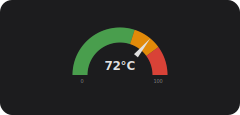
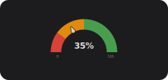
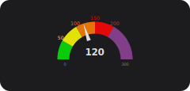
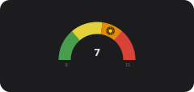
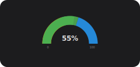
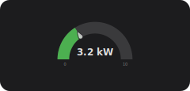
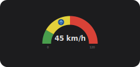
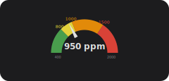
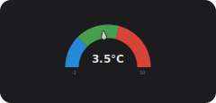
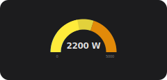

# Extended Gauge Card — Example Configurations

A collection of ready-to-use YAML configurations showcasing different Extended Gauge Card features.
Copy any example into your Lovelace dashboard and adjust the `entity` field to match your Home Assistant setup.

> Preview images show a representative value for each configuration.
> To regenerate them after changes, run `node utils/scripts/generate-previews.js` from the repository root.

---

## CPU / SoC Temperature

Shows processor temperature with colour-coded warning zones.
Green up to 60 °C, amber from 60–80 °C, red above 80 °C.



```yaml
type: custom:extended-gauge-card
title:
  title: CPU Temperature
entity:
  entity: sensor.processor_temperature
  settings:
    unit_of_measurement: "°C"
    decimals: 1
main:
  min_value: 0
  max_value: 100
  display_mode: gauge_and_needle
  needle:
    needle_style: default
segment_list:
  - title: normal
    settings:
      segment_lower: 0
      segment_upper: 60
      segment_color: [76, 175, 80]
  - title: warm
    settings:
      segment_lower: 60
      segment_upper: 80
      segment_color: [255, 152, 0]
  - title: hot
    settings:
      segment_lower: 80
      segment_upper: 100
      segment_color: [244, 67, 54]
```

---

## Battery Level

Uses the original Home Assistant needle style with a colour gradient from red (low) to green (full).



```yaml
type: custom:extended-gauge-card
title:
  title: Phone Battery
entity:
  entity: sensor.phone_battery_level
  settings:
    unit_of_measurement: "%"
    decimals: 0
main:
  min_value: 0
  max_value: 100
  display_mode: gauge_and_needle
  needle:
    needle_style: classic
segment_list:
  - title: critical
    settings:
      segment_lower: 0
      segment_upper: 20
      segment_color: [244, 67, 54]
  - title: low
    settings:
      segment_lower: 20
      segment_upper: 50
      segment_color: [255, 152, 0]
  - title: good
    settings:
      segment_lower: 50
      segment_upper: 100
      segment_color: [76, 175, 80]
```

---

## Air Quality Index (AQI)

Follows the standard US AQI colour bands (EPA scale 0–500).
Shows both the coloured segments and the current AQI value with a needle.



```yaml
type: custom:extended-gauge-card
title:
  title: Air Quality Index
entity:
  entity: sensor.air_quality_index
  settings:
    decimals: 0
main:
  min_value: 0
  max_value: 300
  display_mode: gauge_and_needle
  show_segment_labels: true
  needle:
    needle_style: default
segment_list:
  - title: good
    settings:
      segment_lower: 0
      segment_upper: 50
      segment_color: [0, 228, 0]
  - title: moderate
    settings:
      segment_lower: 50
      segment_upper: 100
      segment_color: [255, 255, 0]
  - title: unhealthy_sensitive
    settings:
      segment_lower: 100
      segment_upper: 150
      segment_color: [255, 126, 0]
  - title: unhealthy
    settings:
      segment_lower: 150
      segment_upper: 200
      segment_color: [255, 0, 0]
  - title: very_unhealthy
    settings:
      segment_lower: 200
      segment_upper: 300
      segment_color: [143, 63, 151]
```

---

## Air Quality Index (AQI) with Color Gradient

Follows the same AQI colour bands as above, but with `use_gradient: true` to create a smooth transition between the segment colours.


```yaml
type: custom:extended-gauge-card
title:
  title: Air Quality Index (Smooth)
entity:
  entity: sensor.air_quality_index
  settings:
    decimals: 0
main:
  min_value: 0
  max_value: 300
  display_mode: gauge_and_needle
  show_segment_labels: true
  use_gradient: true
  needle:
    needle_style: default
segment_list:
  - title: good
    settings:
      segment_lower: 0
      segment_upper: 50
      segment_color: [0, 228, 0]
  - title: moderate
    settings:
      segment_lower: 50
      segment_upper: 100
      segment_color: [255, 255, 0]
  - title: unhealthy_sensitive
    settings:
      segment_lower: 100
      segment_upper: 150
      segment_color: [255, 126, 0]
  - title: unhealthy
    settings:
      segment_lower: 150
      segment_upper: 200
      segment_color: [255, 0, 0]
  - title: very_unhealthy
    settings:
      segment_lower: 200
      segment_upper: 300
      segment_color: [143, 63, 151]
```

---

## UV Index

Shows the WHO UV index scale (0–11+) with standard risk-level colours.
Icon needle doubles as a visual sun symbol.



```yaml
type: custom:extended-gauge-card
title:
  title: UV Index
entity:
  entity: sensor.uv_index
  settings:
    decimals: 0
main:
  min_value: 0
  max_value: 11
  display_mode: gauge_and_needle
  needle:
    needle_style: icon
    needle_icon: mdi:white-balance-sunny
    needle_icon_keep_vertical: true
    needle_icon_size: 1.5
    needle_icon_color: [255, 213, 0]
    needle_icon_background_color: [60, 40, 0]
segment_list:
  - title: low
    settings:
      segment_lower: 0
      segment_upper: 3
      segment_color: [76, 175, 80]
  - title: moderate
    settings:
      segment_lower: 3
      segment_upper: 6
      segment_color: [255, 235, 59]
  - title: high
    settings:
      segment_lower: 6
      segment_upper: 8
      segment_color: [255, 152, 0]
  - title: very_high
    settings:
      segment_lower: 8
      segment_upper: 11
      segment_color: [244, 67, 54]
```

---

## Indoor Humidity — Comfort Zone

Highlights the ideal indoor humidity range (40–60 %) in green.
Uses dial mode (no needle) for a clean, minimal look.



```yaml
type: custom:extended-gauge-card
title:
  title: Living Room Humidity
entity:
  entity: sensor.living_room_humidity
  settings:
    unit_of_measurement: "%"
    decimals: 0
main:
  min_value: 0
  max_value: 100
  display_mode: dial_only
segment_list:
  - title: dry
    settings:
      segment_lower: 0
      segment_upper: 40
      segment_color: [255, 152, 0]
  - title: comfort
    settings:
      segment_lower: 40
      segment_upper: 60
      segment_color: [76, 175, 80]
  - title: humid
    settings:
      segment_lower: 60
      segment_upper: 100
      segment_color: [33, 150, 243]
```

---

## Power Consumption (W → kW)

Reads a sensor in watts and displays it in kilowatts using the conversion factor.
Shows both the dial arc and the HA-style needle simultaneously with `display_mode: dial_and_needle`.



```yaml
type: custom:extended-gauge-card
title:
  title: Home Power
entity:
  entity: sensor.home_power_consumption
  settings:
    unit_of_measurement: "kW"
    decimals: 2
    conversion_factor: 1000
main:
  min_value: 0
  max_value: 10
  display_mode: dial_and_needle
  needle:
    needle_style: classic
```

---

## Wind Speed with Direction Icon

Custom range (0–120 km/h), icon needle stays vertical so the compass direction arrow
always points up regardless of the current speed reading.



```yaml
type: custom:extended-gauge-card
title:
  title: Wind Speed
entity:
  entity: sensor.wind_speed
  settings:
    unit_of_measurement: "km/h"
    decimals: 0
main:
  min_value: 0
  max_value: 120
  display_mode: gauge_and_needle
  needle:
    needle_style: icon
    needle_icon: mdi:arrow-up-bold
    needle_icon_keep_vertical: true
    needle_icon_size: 1.5
    needle_icon_color: [144, 202, 249]
    needle_icon_background_color: [13, 71, 161]
segment_list:
  - title: calm
    settings:
      segment_lower: 0
      segment_upper: 20
      segment_color: [76, 175, 80]
  - title: breezy
    settings:
      segment_lower: 20
      segment_upper: 60
      segment_color: [255, 235, 59]
  - title: strong
    settings:
      segment_lower: 60
      segment_upper: 120
      segment_color: [244, 67, 54]
```

---

## Indoor CO₂ Level

Monitors CO₂ concentration (ppm) with standard air-quality thresholds.
Segment labels show the threshold values on the gauge arc.



```yaml
type: custom:extended-gauge-card
title:
  title: CO₂ Level
entity:
  entity: sensor.co2_concentration
  settings:
    unit_of_measurement: "ppm"
    decimals: 0
main:
  min_value: 400
  max_value: 2000
  display_mode: gauge_and_needle
  show_segment_labels: true
  needle:
    needle_style: default
segment_list:
  - title: fresh
    settings:
      segment_lower: 400
      segment_upper: 800
      segment_color: [76, 175, 80]
  - title: acceptable
    settings:
      segment_lower: 800
      segment_upper: 1000
      segment_color: [255, 235, 59]
  - title: poor
    settings:
      segment_lower: 1000
      segment_upper: 1500
      segment_color: [255, 152, 0]
  - title: bad
    settings:
      segment_lower: 1500
      segment_upper: 2000
      segment_color: [244, 67, 54]
```

---

## Refrigerator Temperature

Tight range for food-safety monitoring.
Shows the safe zone (1–5 °C) in green; values outside appear in red or blue.



```yaml
type: custom:extended-gauge-card
title:
  title: Fridge Temperature
entity:
  entity: sensor.fridge_temperature
  settings:
    unit_of_measurement: "°C"
    decimals: 1
main:
  min_value: -2
  max_value: 10
  display_mode: gauge_and_needle
  needle:
    needle_style: classic
segment_list:
  - title: too_cold
    settings:
      segment_lower: -2
      segment_upper: 1
      segment_color: [33, 150, 243]
  - title: safe
    settings:
      segment_lower: 1
      segment_upper: 5
      segment_color: [76, 175, 80]
  - title: too_warm
    settings:
      segment_lower: 5
      segment_upper: 10
      segment_color: [244, 67, 54]
```

---

## Solar Panel Output

Displays current solar generation in watts (0–5000 W).
Dial-only mode with a blue-to-yellow colour progression via segments.



```yaml
type: custom:extended-gauge-card
title:
  title: Solar Output
entity:
  entity: sensor.solar_power
  settings:
    unit_of_measurement: "W"
    decimals: 0
main:
  min_value: 0
  max_value: 5000
  display_mode: dial_only
  show_min_max_values: true
segment_list:
  - title: low
    settings:
      segment_lower: 0
      segment_upper: 1000
      segment_color: [33, 150, 243]
  - title: medium
    settings:
      segment_lower: 1000
      segment_upper: 3000
      segment_color: [255, 235, 59]
  - title: high
    settings:
      segment_lower: 3000
      segment_upper: 5000
      segment_color: [255, 152, 0]
```
